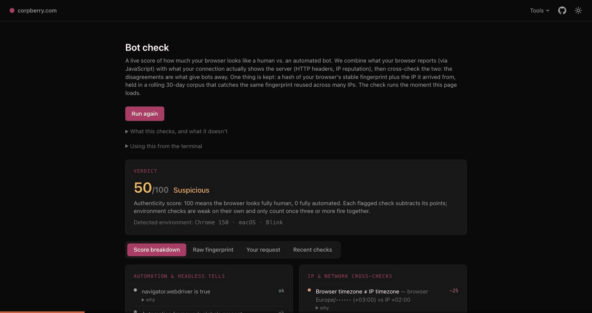

# corpberry.com — site-of-tools

[](LICENSE)
[](go.mod)

My personal site plus a growing collection of small, self-built tools, all
served by **one Go binary** that routes by subdomain: server-rendered HTML with
htmx and Alpine, zero Node, and every endpoint is also a JSON API. All open
source.

**Live now:**

- 🤖 **[Bot check](https://botcheck.corpberry.com)** — a live, transparent score of how human vs. automated your browser looks: a client-side fingerprint fused with server headers + IP reputation, cross-checked, with all 68 signals shown. *(the flagship)*
- 🌍 **[IP tools](https://ip.corpberry.com)** — IP geolocation / ASN / proxy-VPN lookup, a "your connection" inspector, and a subnet/CIDR calculator.
- 🏠 **[corpberry.com](https://corpberry.com)** — portfolio + tool index.

<p align="center">
  
</p>

## Bot check — the flagship

A free, open-source bot-detection **self-test** (not a WAF: it blocks nothing).
Open the page and it scores your browser 0–100 on how human vs. automated it
looks, with a verdict (human / suspicious / bot, or *good-bot* for a verified
crawler) and a transparent, per-signal breakdown. The idea: any browser can
*claim* to be Chrome on Windows, so it cross-checks that claim against the HTTP
headers and IP reputation (datacenter / VPN / proxy / Tor) the server actually
sees, and shows where they disagree. Tested against real Puppeteer, Playwright,
and puppeteer-extra-stealth.

```bash
curl https://botcheck.corpberry.com -H "Accept: application/json"
```

More detail and my firsthand research on 12 commercial detectors live in
[tools/botcheck/docs/](tools/botcheck/docs/README.md).

## Stack

Go 1.26 · Echo v5 · `html/template` · htmx · Alpine.js · Tailwind (standalone
CLI, no npm) · MongoDB (IP-tool lookup history + request-log corpus; optional —
empty `MONGODB_URI` disables it, app runs stateless) · Docker (distroless).
Server-rendered HTML, htmx for interactive bits; every endpoint also returns
JSON for CLI/API callers.

## Quick start (dev)

Install **Go 1.26+** first (system-level, once):
```bash
sudo rm -rf /usr/local/go && sudo tar -C /usr/local -xzf go1.26.5.linux-arm64.tar.gz
echo 'export PATH=$PATH:/usr/local/go/bin' >> ~/.bashrc && source ~/.bashrc
```
Then:
```bash
git clone git@github.com:Landver/site-of-tools.git
cd site-of-tools

cp .env.example .env      # set IP2LOCATION_DOWNLOAD_TOKEN (for `make assets`); MONGODB_URI optional (empty disables Mongo)
make deps                 # go mod tidy (writes go.sum)
make tools                # Tailwind binary + air + enable git hooks
make assets               # download the IP2Location LITE .BIN databases
make css                  # build shared/static/css/styles.css

make css-watch &          # rebuild CSS on edits
make dev                  # air: live-reload the server (APP_ENV=dev)
```

Open **http://ip.localhost:8080** + **http://localhost:8080** (`*.localhost`
routes to 127.0.0.1 auto, subdomain routing works locally).

CLI/JSON side:
```bash
curl 'http://ip.localhost:8080/?ip=8.8.8.8'
```

## Tests

```bash
make test          # go test ./... -race
```
Pre-push git hook (`make hooks`, also run by `make tools`) runs `go vet` +
`go test`, blocks push on failure.

## Production

Runs Docker behind nginx behind Cloudflare, same host.
```bash
git pull
docker compose up -d --build
```
nginx blocks live in [deploy/nginx/](deploy/nginx/); full steps in
[docs/DEPLOYMENT.md](docs/DEPLOYMENT.md).

## Docs

- [docs/ARCHITECTURE.md](docs/ARCHITECTURE.md) — design: host routing, request
  layering, content negotiation, embedding, config, testing, adding a tool
- [docs/DEPLOYMENT.md](docs/DEPLOYMENT.md) — Cloudflare → nginx → Docker, ports, IP trust
- [tools/iptools/](tools/iptools/docs/README.md) — the IP tools
- [tools/botcheck/](tools/botcheck/docs/README.md) — the Bot check tool (docs split by topic: RESEARCH.md, roadmap/, testing/, reports/)
- [CLAUDE.md](CLAUDE.md) — conventions for anyone (incl. AI) developing here

## Layout

```
main.go            entrypoint (single binary)
platform/          shared engine: config · app factory · renderer + negotiation · mongo client
shared/            shared front-end: base partials + htmx/alpine/tailwind css
site/              apex project (corpberry.com)
tools/             self-contained tool subdomains (code + docs co-located):
                     iptools/   IP tools: code · templates · assets (.BIN) · README
                     botcheck/  Bot check: code · templates · README · RESEARCH · roadmap/ · testing/ · reports/
deploy/nginx/      reverse-proxy server blocks
docs/              architecture & deployment
```

## Attribution

IP tools (`ip.corpberry.com`) use IP2Location LITE database for
[IP geolocation](https://lite.ip2location.com). Exact acknowledgment
IP2Location's LITE license requires, shown on tool's own pages — only ones
that use the data (apex doesn't, so omits credit).
